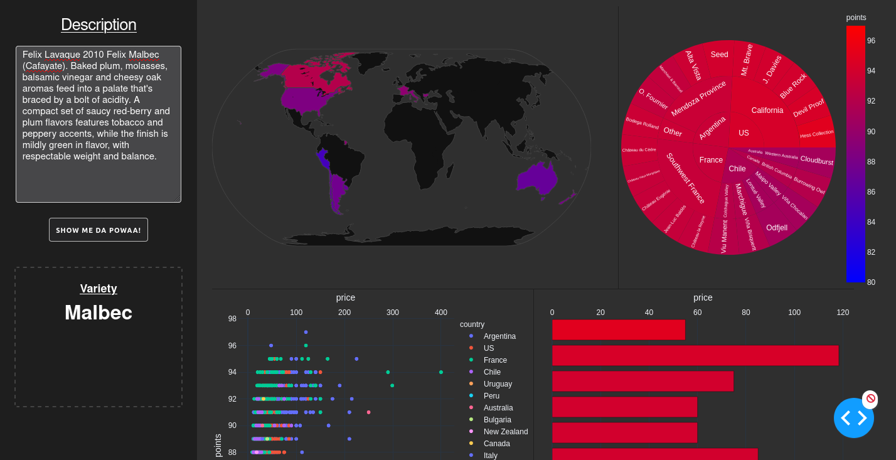
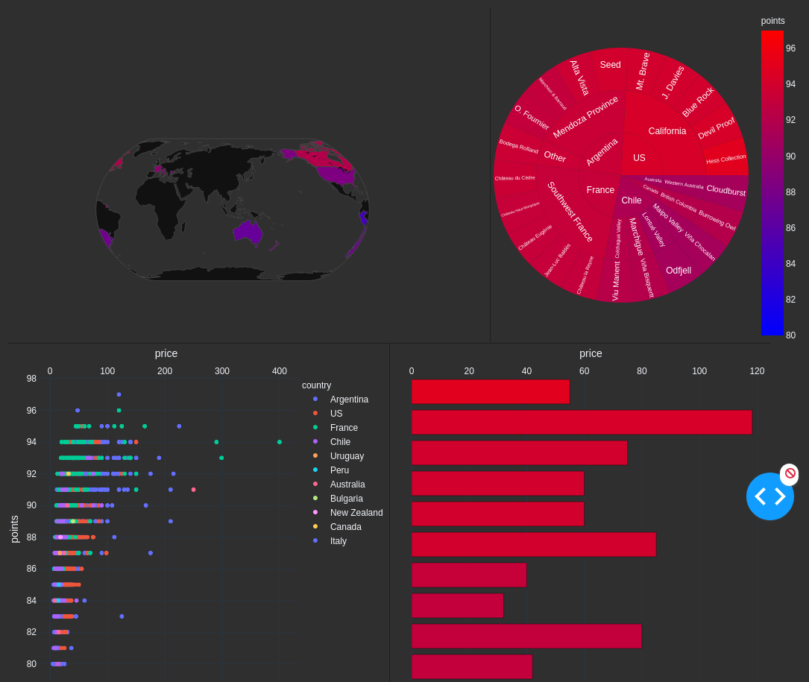

# Wine-Classifier

Dataset : https://www.kaggle.com/zynicide/wine-reviews

### Run

```
docker build -t incy_winec .
docker run --rm -p 8050:8050 incy_winec:latest
```

### Model (To be improved):
Log reg using countvectorizer on title and description.

### Dashboard:
Plotly and dash
1. Map showing countries of production with average points in color.
2. Sunburst showing 90+ rated top 5 wineries for each country.
3. Scatter Price-Plot distribution for all listed wineries in dataset.
4. Bar chart with top 10 wineries accorading to avg. points and their prices.

### Demo:
[Heroku](https://incy-winec.herokuapp.com/)

### Screenshots:


